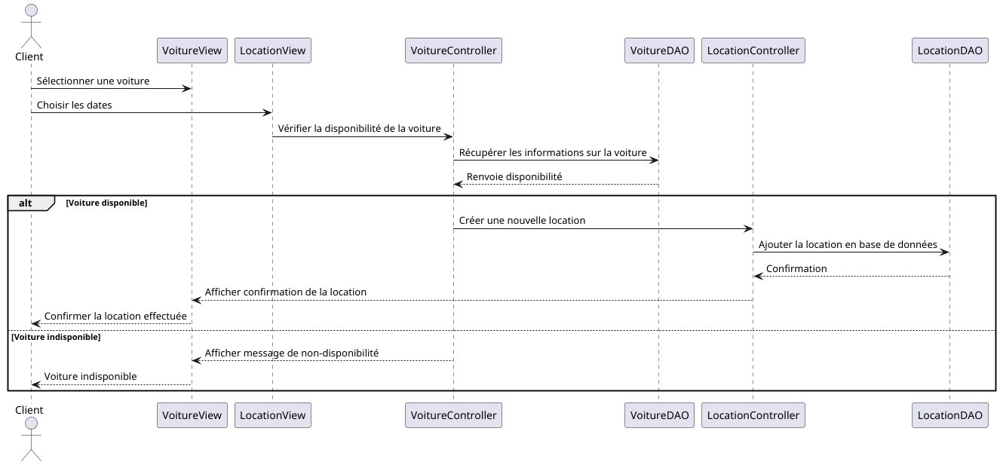

# Gestion de Location de Voitures

## Description
Ce projet consiste à développer une application de gestion de location de voitures en Java. 
Cette première version met en place la structure du projet et les configurations de base.

# Gestion de Location de Voitures - Branche 01-poo-basics
## Pre-requis 
- Git
- Java 21 
- Maven
- vscode ou eclipse 

## Objectif
Cette branche met en place les concepts fondamentaux de la **programmation orientée objet (POO)** avec un exemple de gestion de voitures thermiques et électriques. Les principales notions abordées sont :
- Encapsulation
- Héritage
- Polymorphisme
- Surcharge
- Redéfinition de méthodes (Override)

## Classes et structure
1. **Voiture (classe abstraite)** :
    - Représente la classe de base pour toutes les voitures.
    - Contient des attributs comme la marque, le modèle, l'année, et le prix par jour.
    - Définit des méthodes abstraites `afficherInfo()` et `calculerConsommation()` que les sous-classes doivent implémenter.

2. **VoitureThermique (hérite de Voiture)** :
    - Spécialisation pour les voitures thermiques avec un attribut supplémentaire : consommation de carburant (litres/100 km).
    - Implémente les méthodes abstraites de `Voiture` pour afficher des informations spécifiques et calculer la consommation.

3. **VoitureElectrique (hérite de Voiture)** :
    - Spécialisation pour les voitures électriques avec un attribut supplémentaire : autonomie de la batterie (en km).
    - Implémente les méthodes abstraites de `Voiture` pour afficher des informations spécifiques et calculer l'autonomie.

## Principes POO abordés

### 1. Encapsulation
Chaque classe encapsule ses attributs et utilise des **getters** et **setters** pour y accéder de manière contrôlée. Cela permet de protéger les données et de les rendre accessibles uniquement via des méthodes définies.

### 2. Héritage
Les classes `VoitureThermique` et `VoitureElectrique` héritent de la classe abstraite `Voiture`. Elles réutilisent les attributs et les méthodes de `Voiture` et ajoutent des fonctionnalités spécifiques à leur type de véhicule.

### 3. Polymorphisme
Grâce au polymorphisme, il est possible de manipuler des objets de différentes sous-classes (`VoitureThermique` et `VoitureElectrique`) comme des objets de type `Voiture`. Cela permet de traiter les deux types de voitures de manière générique tout en bénéficiant de leurs particularités.

Exemple d'utilisation :
```java
Voiture voitureThermique = new VoitureThermique("Renault", "Megane", 2018, 40.0, 6.5);
Voiture voitureElectrique = new VoitureElectrique("Tesla", "Model 3", 2022, 100.0, 450);

voitureThermique.afficherInfo();
voitureElectrique.afficherInfo();

```
## Execution 


```bash 
cd demo/
mvn compile
mvn exec:java -Dexec.mainClass="com.rmoss.getscar.App"
```

# Projet de Gestion de Location de Voitures - Branche 02-uml-design

## Objectif
Dans cette branche, nous mettons en place la **modélisation UML** pour représenter les structures de classes, les relations entre elles et les cas d'utilisation de l'application. Nous utilisons **PlantUML** pour générer les diagrammes UML.

Les principaux diagrammes UML créés sont :
1. **Diagramme de classes** : Représentation des classes principales et de leurs relations.
2. **Diagramme de cas d’utilisation** : Visualisation des interactions entre les acteurs et le système.
3. **Diagramme de séquence** (facultatif) : Visualisation des interactions dynamiques entre les objets lors d'une location de voiture.

## Structure des fichiers PlantUML

Les fichiers PlantUML sont stockés dans le répertoire `uml/` et peuvent être générés à l’aide de l’outil **PlantUML**.

- **`classes.puml`** : Contient le diagramme de classes.
- **`usecases.puml`** : Contient le diagramme de cas d’utilisation.
- **`sequence-location.puml`** (facultatif) : Contient le diagramme de séquence pour la location d'une voiture.

---

## Diagrammes UML

### 1. Diagramme de classes

Ce diagramme représente les principales classes du projet, ainsi que leurs relations. La classe abstraite `Voiture` est héritée par `VoitureThermique` et `VoitureElectrique`. La classe `Client` est associée à la classe `Location`, qui relie un client à une voiture pour une période donnée.
- **Client** "0..*" --> "1" Location : effectue : Un client peut effectuer plusieurs locations.
- **Voiture** "0..*" --> "1" Location : est louée dans : Une voiture peut être louée dans plusieurs locations.


### 2. Diagramme de cas d'utilisation

Ce diagramme montre les principales interactions entre l'utilisateur et le système. Les utilisateurs peuvent ajouter des voitures, des clients, effectuer des locations, et afficher l'historique des locations.


Acteur : L'Utilisateur représente l'acteur principal qui interagit avec le système.
Cas d'utilisation :
- **Ajouter une Voiture** : Permet à l'utilisateur d'ajouter une nouvelle voiture dans le système.
- **Ajouter un Client** : Permet d'ajouter les informations d'un nouveau client.
- **Effectuer une Location** : Permet de créer une location en liant une voiture et un client.
- **Afficher l'Historique des Locations** : Permet de consulter l'historique des locations effectuées.

### 3. Diagramme de séquence (facultatif)

Ce diagramme montre le processus de location d'une voiture. Il décrit comment un client sélectionne une voiture, choisit les dates, et effectue la location. Le système vérifie la disponibilité de la voiture avant de créer une nouvelle location.



---

## Comment générer les diagrammes

Pour générer les diagrammes à partir des fichiers `.puml`, utilisez **PlantUML** avec les commandes suivantes :
1. Installer le plugin PlantUML
2. Editer les fichiers uml


